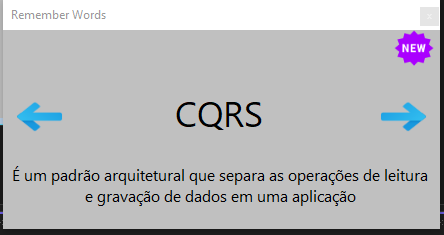

# Remember Words

Este projeto foi desenvolvido com o objetivo de auxiliar os usuários na memorização de conteúdo estudado. Ele está integrado ao Speech Synthesizer, que pronuncia a palavra e sua descrição, facilitando a retenção das informações.

Implementado em .NET Core 8.0 com Windows Forms, o projeto possui dependência de uma biblioteca de classes também em .NET Core 8.0. Adotei uma arquitetura de três camadas, promovendo a organização e a separação das responsabilidades entre as classes.

  

**Projeto:** .NET Core, C#, JSON, 3 Camadas, Speech Synthesizer

**Links:**
* [LinkedIn](https://www.linkedin.com/in/joao-pedro-fernandes-95a125180/)
* [Meu Blog](https://medium.com/@joaop_25)
